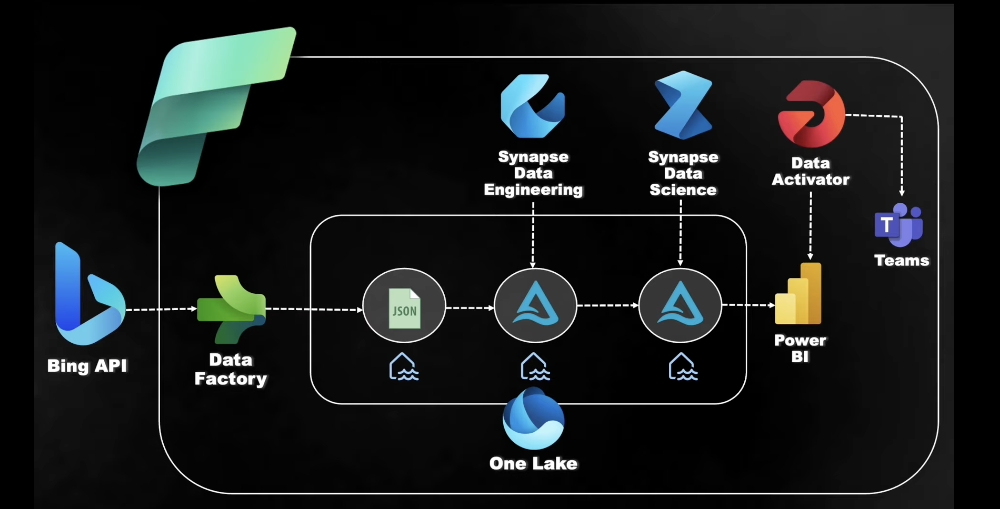

# Sentiment Analysis on News Data Using Microsoft Fabric

## Project Overview

This project aims to perform sentiment analysis on news data sourced from the Bing API. By leveraging the Microsoft Fabric ecosystem, the project showcases a comprehensive data pipeline, including data ingestion, transformation, machine learning, and visualization. The end goal is to analyze news sentiment and create a dynamic dashboard that triggers alerts based on specific conditions.

## Table of Contents

- [Introduction](#introduction)
- [Architecture](#architecture)
- [Tools and Technologies](#tools-and-technologies)
- [Project Workflow](#project-workflow)
  - [1. Data Ingestion](#1-data-ingestion)
  - [2. Data Storage](#2-data-storage)
  - [3. Data Transformation](#3-data-transformation)
  - [4. Sentiment Analysis](#4-sentiment-analysis)
  - [5. Visualization](#5-visualization)
  - [6. Alerts](#6-alerts)
- [Setup and Configuration](#setup-and-configuration)

## Introduction

In today's information-driven world, understanding the sentiment of news can provide valuable insights for decision-making, trend analysis, and more. This project focuses on analyzing the sentiment of news articles retrieved using the Bing API, processed through various components of Microsoft Fabric, and ultimately visualized in Power BI.

## Architecture

The architecture of this project includes the following components:

- **Bing API**: Data source for retrieving news-related JSON data.
- **Azure Data Factory**: Used for ingesting the raw JSON data into Microsoft Fabric.
- **Microsoft Fabric Lakehouse**: Storage for raw and processed data in Delta format.
- **Data Engineering Component**: Transformation of raw JSON data into Delta tables.
- **Data Science Component**: Running a sentiment analysis machine learning model.
- **Power BI**: Visualization of the sentiment analysis results.
- **Data Activator**: Sends alerts to Microsoft Teams based on conditions set in the Power BI dashboard.

## Tools and Technologies

- **Bing API**: For fetching news data.
- **Azure Data Factory**: For data ingestion.
- **Microsoft Fabric Lakehouse**: For data storage.
- **Data Engineering Component**: For data transformation.
- **Data Science Component**: For machine learning and sentiment analysis.
- **Power BI**: For creating dashboards and visualizations.
- **Data Activator**: For setting up alerts.
- **Microsoft Teams**: For receiving alerts.

## Project Workflow

### 1. Data Ingestion

- **Source**: News data is fetched using the Bing API.
- **Ingestion**: Azure Data Factory is utilized to ingest the JSON-formatted news data into the Lakehouse.

### 2. Data Storage

- **Storage**: The raw JSON data is stored in Microsoft Fabric's Lakehouse.

### 3. Data Transformation

- **Transformation**: Using the Data Engineering component, the raw data is transformed into Delta table format, making it ready for further processing.

### 4. Sentiment Analysis

- **Modeling**: The Data Science component is used to run a sentiment analysis machine learning model on the Delta table.
- **Classification**: Each news article is classified as positive, neutral, or negative based on the sentiment analysis.

### 5. Visualization

- **Dashboard**: The results of the sentiment analysis are visualized in a Power BI dashboard. Users can interact with the data to gain insights.

### 6. Alerts

- **Data Activator**: Alerts are configured in Data Activator to monitor specific conditions in the Power BI dashboard.
- **Notifications**: When conditions are met, notifications are sent to Microsoft Teams.

## Setup and Configuration

1. **Bing API Setup**:
   - Register and obtain API keys for accessing Bing's news data.
   
2. **Azure Data Factory**:
   - Create a Data Factory instance and configure pipelines to ingest data from Bing API.

3. **Microsoft Fabric**:
   - Set up a Lakehouse for storing the ingested data.
   - Use the Data Engineering component to transform the data into Delta format.
   - Use the Data Science component to apply sentiment analysis.

4. **Power BI**:
   - Create a Power BI dashboard to visualize the sentiment analysis results.

5. **Data Activator**:
   - Configure alerts based on conditions set in the Power BI dashboard.

6. **Microsoft Teams**:
   - Ensure Microsoft Teams is set up to receive notifications from Data Activator.

